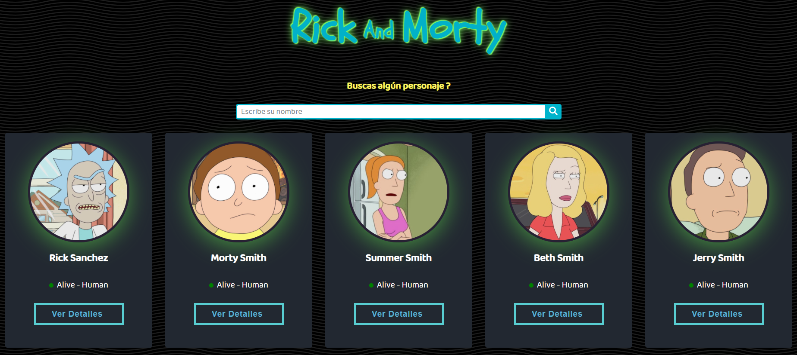
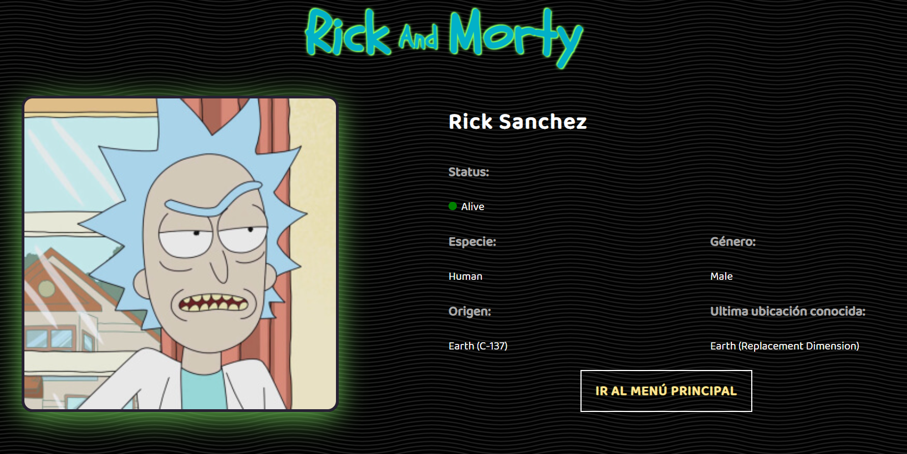

# Eiteck-prueba-frontend

Frontend para consumir API de Rick y Morty con React utilizando Redux como patrón para consumir los datos y manejar los estados dentro de la página.

# 

# Demo

👉 Puedes revisar la demo <a href="https://eiteck-prueba-frontend.netlify.app/">aquí</a>.
<br>

# 

# 

# Requisitos

- Node Js

# Uso

- Descargar la carpeta
- Descomprimir
- Ejecutar dentro de la carpeta

```sh
$ npm start
```

## Desarrollado con

- [React](https://es.reactjs.org/)
- [React-Icons](https://react-icons.github.io/react-icons)

#### Estilos

- [StyledComponents](https://styled-components.com/)
- CSS

## Arquitectura usada

-Redux

# 

## Deploy realizado con

- [Netlify](https://electron.atom.io)
